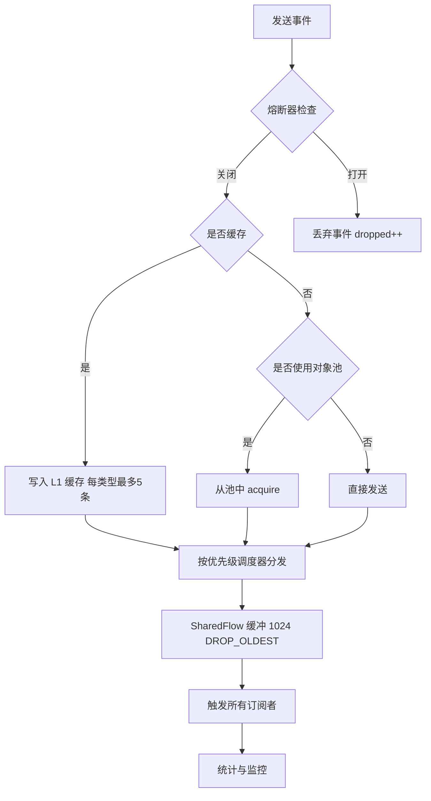

# Mold EventBus

## SDK 基本信息

| 项目 | 内容 |
| --- | --- |
| 名称 | Mold EventBus（`eventBus`） |
| 用途 | 基于 Kotlin Flow 与协程的生产级事件总线，提供类型安全、生命周期感知、高吞吐的事件通信能力 |
| 语言 / 平台 | Kotlin Multiplatform（Android / iOS / Desktop-JVM），Compose Multiplatform |
| 包管理器与安装命令 | Gradle（Maven / JitPack），详见[安装](#4-安装) |
| 当前版本 | `1.1.22` |
| License | MIT <!-- TODO: 待确认 —— 仓库内暂未发现 LICENSE 文件，发布前请补充并核对许可证文本 --> |
| 目标读者 | 需要事件驱动解耦、跨模块通信的 Android / KMP 应用开发者 |

> 坐标：`com.github.MucTao.Mold:eventBus:1.1.22`

---

## 目录

1. [简介与特性](#1-简介与特性)
2. [环境要求](#2-环境要求兼容性矩阵表格)
3. [安装](#3-安装)
4. [快速开始](#4-快速开始含最小可运行示例--预期输出)
5. [核心概念](#5-核心概念)
6. [配置说明](#6-配置说明表格字段类型必填默认值说明)
7. [API 参考](#7-api-参考)
8. [错误码表](#8-错误码表)
9. [常见场景示例](#9-常见场景示例至少-3-个认证分页批量错误处理)
10. [常见问题 FAQ](#10-常见问题-faq至少-5-条)
11. [版本与变更](#11-版本与变更)
12. [License](#12-license)

---

## 1. 简介与特性

**Mold EventBus** 是一个面向生产环境的事件总线，核心引擎基于 `MutableSharedFlow` 与 Kotlin 协程构建，专为多模块 / 多进程场景下的解耦通信设计。

主要特性：

- **类型安全**：事件必须实现 `AppEvent` 接口，订阅按具体事件类型（`reified` 泛型）分发，无需字符串标签。
- **生命周期感知**：提供绑定 `LifecycleOwner` 的订阅方式，随界面生命周期自动启停，避免内存泄漏。
- **5 级优先级调度**：`CRITICAL / HIGH / NORMAL / LOW / BACKGROUND` 分别映射到不同并发度的调度器。
- **熔断保护（Circuit Breaker）**：发送持续失败时自动熔断，防止雪崩；超时后自动进入半开状态恢复。
- **事件缓存与粘性订阅**：`cacheable` 事件按类型缓存（每类型最多 5 条），新订阅者可立即收到最近一次事件。
- **对象池（Object Pool）**：`usePool` 复用实现了 `Resettable` 的事件对象，降低高频事件场景的 GC 压力。
- **批量处理与响应式操作符**：批量发送、`debounce` / `throttle` / 事件追踪等扩展函数开箱即用。
- **可观测性**：内置事件统计（总量、丢弃量、平均耗时、按类型计数、缓冲水位），支持定时监控日志。

---

## 2. 环境要求（兼容性矩阵表格）

| 项目 | 要求 |
| --- | --- |
| Kotlin | ≥ 2.4.10（项目使用版本） |
| Gradle | ≥ 8.x（JitPack 构建使用 9.6.1） |
| Android compileSdk | 37 |
| Android minSdk | 21 |
| JVM 目标 | 11（`jvmTarget = JVM_11`） |
| Compose Multiplatform | 1.11.1（`compose-runtime` 依赖） |
| 协程 | kotlinx-coroutines 1.11.0 |
| 日志 | kotlin-logging 8.0.4 + slf4j-simple 2.0.18（运行时可选） |

**平台目标矩阵**：

| 平台 | 支持 | 说明 |
| --- | --- | --- |
| Android | ✅ | 默认目标 |
| iOS（iosArm64 / iosSimulatorArm64） | ✅ | 构建时默认启用（`isOnlyAndroid=false` 时） |
| Desktop（JVM） | ✅ | 构建时默认启用 |
| Web（Wasm/JS） | ❌ | 当前未配置 |

> 说明：当 `gradle.properties` 中 `isOnlyAndroid=true` 或环境变量 `JITPACK=true` 时，只构建 Android 目标。

---

## 3. 安装

### 3.1 配置仓库

EventBus 通过 JitPack 发布（`com.github.MucTao`），需要在 `settings.gradle.kts` 或根 `build.gradle.kts` 中声明仓库：

```kotlin
// settings.gradle.kts
dependencyResolutionManagement {
    repositories {
        google()
        mavenCentral()
        maven { url = uri("https://www.jitpack.io") }
    }
}
```

### 3.2 声明依赖

```kotlin
// 模块 build.gradle.kts
dependencies {
    implementation("com.github.MucTao.Mold:eventBus:1.1.22")
}
```

### 3.3 本地仓库（可选）

若团队内部使用本地 Maven 仓库（`F:/Android/WorkSpace/repo`）：

```kotlin
repositories {
    maven { url = uri("F:/Android/WorkSpace/repo") }
}
```

> 提示：版本号以 `gradle/libs.versions.toml` 中 `mold-version` 为准，升级 SDK 时请同步修改。

---

## 4. 快速开始（含最小可运行示例 + 预期输出）

### 4.1 定义事件

所有事件需实现 `AppEvent` 接口（空接口，仅作类型标记）：

```kotlin
import org.muc.eventbus.event.AppEvent

sealed class AppEvent {
    object UserLoginSuccess : AppEvent()
    data class UserLoginFailed(val error: String) : AppEvent()
    data class ShowToast(val message: String) : AppEvent()
}
```

### 4.2 创建总线实例

```kotlin
import org.muc.eventbus.event.core.EventBus

// 在 Application / DI 容器中创建单例
val eventBus = EventBus()

// 建议在 Application.onCreate() 或根 Composable 中调用一次（幂等）
eventBus.initialize(enableMonitoring = false)
```

### 4.3 发送与订阅（最小闭环）

```kotlin
import kotlinx.coroutines.CoroutineScope
import kotlinx.coroutines.Dispatchers
import kotlinx.coroutines.launch

val scope = CoroutineScope(Dispatchers.Default)

// 订阅（任意 CoroutineScope 中）
val job = eventBus.subscribe<AppEvent.ShowToast>(scope) { event ->
    println("收到事件: ${event.message}")
}

// 发送（suspend 函数）
scope.launch {
    eventBus.send(AppEvent.ShowToast("Hello EventBus"))
}
```

### 4.4 预期输出

```text
收到事件: Hello EventBus
```

> `subscribe` 返回 `Job`，取消它即可停止订阅；`send` 返回 `Boolean`，`true` 表示事件已被缓冲 / 分发。

---

## 5. 核心概念

### 5.1 事件（AppEvent）

`AppEvent` 是一个空接口，作为所有事件类型的标记。推荐使用 `sealed class` / `sealed interface` 组织业务事件。

### 5.2 优先级（Priority）

`enum class Priority(val level: Int)`：

| 优先级 | level | 调度器 | 适用场景 |
| --- | --- | --- | --- |
| `CRITICAL` | 4 | `Dispatchers.Main` 并发 1 | 必须立即处理的关键事件 |
| `HIGH` | 3 | `Dispatchers.IO` 并发 4 | 高优任务（如 UI 刷新） |
| `NORMAL` | 2 | `Dispatchers.IO` 并发 8 | 默认，普通业务事件 |
| `LOW` | 1 | `Dispatchers.IO` 并发 2 | 低优任务 |
| `BACKGROUND` | 0 | `Dispatchers.IO` 并发 1 | 后台任务（埋点、日志） |

### 5.3 发送链路（熔断 → 缓存 → 批量/对象池 → 分发）



### 5.4 缓存与粘性订阅

- `cacheable = true` 的事件会按事件类型写入 `l1Cache`（`MutableMap<KClass, MutableList<AppEvent>>`），**每类型最多保留 5 条**，超出后移除最旧的。
- `subscribeSticky` 在订阅时立即投递最近一条缓存事件，随后转入常规订阅。
- 可通过 `getCachedEvent<T>()` 手动取缓存，`clearCache()` 清空全部缓存。

### 5.5 熔断器（CircuitBreaker）

| 参数 | 默认值 | 含义 |
| --- | --- | --- |
| `failureThreshold` | 5 | 连续失败 N 次后熔断（OPEN） |
| `timeout` | 5000ms | OPEN 后等待 N 毫秒尝试半开（HALF_OPEN） |
| `halfOpenMaxAttempts` | 3 | 半开状态下连续成功 N 次后复位（CLOSED） |

`initialize()` 会启动自动恢复协程：OPEN 状态下每 `timeout` 毫秒尝试 `tryReset()`。

### 5.6 对象池（EventPool）

- 池容量默认 `100`。
- 使用 `usePool = true` 时，事件对象从池中复用；若事件实现了 `Resettable`，释放时会调用 `reset()` 后回池。
- 池统计（命中率等）可通过 `getStats()` 查看。**高频事件场景建议 `usePool = false`**，以避免对象池自身的锁竞争与 GC 压力。

---

## 6. 配置说明（表格：字段/类型/必填/默认值/说明）

> EventBus 无需外部配置文件，以下均为 `EventBus` / `CircuitBreaker` 构造参数或方法参数。

### 6.1 EventBus 方法参数

| 字段 | 类型 | 必填 | 默认值 | 说明 |
| --- | --- | --- | --- | --- |
| `event` | `AppEvent` | 是 | — | 待发送的事件对象 |
| `priority` | `Priority` | 否 | `NORMAL` | 事件优先级，决定调度器与并发度 |
| `usePool` | `Boolean` | 否 | `false` | 是否使用对象池复用事件对象 |
| `cacheable` | `Boolean` | 否 | `false` | 是否缓存事件（支持粘性订阅） |
| `enableMonitoring` | `Boolean` | 否 | `false` | `initialize()` 是否启动每 30s 的统计监控日志 |

### 6.2 CircuitBreaker 构造参数

| 字段 | 类型 | 必填 | 默认值 | 说明 |
| --- | --- | --- | --- | --- |
| `failureThreshold` | `Int` | 否 | `5` | 连续失败阈值 |
| `timeout` | `Long` | 否 | `5000L` | 熔断后恢复探测间隔（ms） |
| `halfOpenMaxAttempts` | `Int` | 否 | `3` | 半开状态成功复位阈值 |

### 6.3 EventPool 构造参数

| 字段 | 类型 | 必填 | 默认值 | 说明 |
| --- | --- | --- | --- | --- |
| `maxSize` | `Int` | 否 | `100` | 对象池最大容量 |

### 6.4 内部常量（不可配置）

| 常量 | 值 | 说明 |
| --- | --- | --- |
| 缓冲容量 `BUFFER_SIZE` | 1024 | SharedFlow `extraBufferCapacity` |
| 每类型最大缓存 `MAX_CACHE_PER_TYPE` | 5 | L1 缓存每类型条数上限 |
| 缓冲溢出策略 | `DROP_OLDEST` | 缓冲满时丢弃最旧事件 |

---

## 7. API 参考

包结构：`org.muc.eventbus`

- `org.muc.eventbus.event` — `AppEvent`、`Priority`
- `org.muc.eventbus.event.core` — `EventBus`、`CircuitBreaker`、`EventPool`、`EventStats`、`UltimateStats`、`Resettable`
- `org.muc.eventbus.utils` — 扩展函数与 Compose 收集器

### 7.1 `AppEvent`

```kotlin
interface AppEvent
```

所有事件的标记接口。

| 方法 | 签名 |
| --- | --- |
| （无） | 空接口 |

### 7.2 `Priority`

```kotlin
enum class Priority(val level: Int) {
    CRITICAL(4), HIGH(3), NORMAL(2), LOW(1), BACKGROUND(0)
}
```

| 属性 | 类型 | 说明 |
| --- | --- | --- |
| `level` | `Int` | 优先级数值，越大越优先 |

### 7.3 `EventBus`

```kotlin
class EventBus
```

主总线类，线程安全。**无参构造，建议单例**。

#### `initialize`

```kotlin
fun initialize(enableMonitoring: Boolean = false)
```

启动熔断器自动恢复协程，可选启用统计监控。

- 参数：见 [6.1](#61-eventbus-方法参数)。
- 返回值：无。
- 异常：无（幂等，重复调用直接返回）。

#### `send`

```kotlin
suspend fun send(
    event: AppEvent,
    priority: Priority = Priority.NORMAL,
    usePool: Boolean = false,
    cacheable: Boolean = false
): Boolean
```

发送事件。

| 参数 | 类型 | 说明 |
| --- | --- | --- |
| `event` | `AppEvent` | 事件对象 |
| `priority` | `Priority` | 优先级 |
| `usePool` | `Boolean` | 是否对象池复用 |
| `cacheable` | `Boolean` | 是否缓存 |

- 返回值：`true` 表示事件已缓冲 / 分发；`false` 表示被熔断丢弃或发送异常。
- 异常：内部捕获所有 `Exception` 并记录日志，不向上抛出。

**示例**：

```kotlin
scope.launch {
    val ok = eventBus.send(AppEvent.ShowToast("hi"), priority = Priority.HIGH, cacheable = true)
    println("发送结果: $ok")
}
```

#### `subscribe`

```kotlin
inline fun <reified T : AppEvent> subscribe(
    scope: CoroutineScope,
    priority: Priority = Priority.NORMAL,
    crossinline onEvent: suspend (T) -> Unit
): Job
```

订阅指定类型事件。

| 参数 | 类型 | 说明 |
| --- | --- | --- |
| `scope` | `CoroutineScope` | 订阅协程作用域，随其取消而停止 |
| `priority` | `Priority` | 订阅侧调度优先级 |
| `onEvent` | `suspend (T) -> Unit` | 事件回调 |

- 返回值：`Job`，可手动取消。
- 异常：回调内部异常被 `catch` 记录日志，不影响订阅持续。

**示例**：

```kotlin
val job = eventBus.subscribe<AppEvent.UserLoginSuccess>(scope) { event ->
    // 处理登录成功
}
// job.cancel() 停止订阅
```

#### `subscribeSticky`

```kotlin
inline fun <reified T : AppEvent> subscribeSticky(
    scope: CoroutineScope,
    crossinline onEvent: suspend (T) -> Unit
)
```

粘性订阅：立即收到最近一次缓存事件（如有），随后接收新事件。

- 返回值：无（内部创建两个协程）。
- 示例：

```kotlin
eventBus.subscribeSticky<AppEvent.UserLoginSuccess>(scope) { event ->
    // 立即收到缓存的登录成功事件（若存在）
}
```

#### `getCachedEvent`

```kotlin
suspend inline fun <reified T : AppEvent> getCachedEvent(): T?
```

获取指定类型最近缓存的（最后一条）事件。

- 返回值：`T?`，无缓存返回 `null`。

#### `clearCache`

```kotlin
suspend fun clearCache()
```

清空全部事件缓存。

#### `getStats`

```kotlin
suspend fun getStats(): UltimateStats
```

获取运行统计。

- 返回值：`UltimateStats`：

| 字段 | 类型 | 说明 |
| --- | --- | --- |
| `totalEvents` | `Long` | 累计发送（尝试）事件数 |
| `droppedEvents` | `Long` | 被丢弃事件数 |
| `bufferSize` | `Int` | 当前缓冲内事件数 |
| `cacheSize` | `Int` | 缓存类型数 |
| `circuitBreakerState` | `String` | 熔断器状态（CLOSED/OPEN/HALF_OPEN） |
| `poolStats` | `EventPool.PoolStats` | 对象池统计 |
| `eventStats` | `EventStats.Stats` | 事件级统计 |

**示例**：

```kotlin
scope.launch {
    val stats = eventBus.getStats()
    println("总量=${stats.totalEvents} 丢弃=${stats.droppedEvents} 熔断=${stats.circuitBreakerState}")
}
```

### 7.4 `CircuitBreaker`

```kotlin
class CircuitBreaker(
    private val failureThreshold: Int = 5,
    private val timeout: Long = 5000L,
    private val halfOpenMaxAttempts: Int = 3
)
```

| 方法 | 签名 | 说明 |
| --- | --- | --- |
| `isOpen` | `fun isOpen(): Boolean` | 是否处于熔断状态 |
| `recordFailure` | `fun recordFailure()` | 记录一次失败 |
| `recordSuccess` | `fun recordSuccess()` | 记录一次成功 |
| `tryReset` | `fun tryReset(): Boolean` | 尝试从 OPEN 进入 HALF_OPEN |
| `reset` | `fun reset()` | 强制复位为 CLOSED |
| `startAutoRecovery` | `fun startAutoRecovery(scope: CoroutineScope)` | 启动自动恢复协程 |
| `state` | `val state: State` | 当前状态（`State.CLOSED/OPEN/HALF_OPEN`） |

### 7.5 `EventPool`

```kotlin
class EventPool<T : AppEvent>(private val maxSize: Int = 100)
```

| 方法 | 签名 | 说明 |
| --- | --- | --- |
| `acquire` | `suspend fun acquire(block: () -> T): T` | 从池中取对象，池空则执行 `block` 创建 |
| `release` | `suspend fun release(event: T)` | 归还对象（实现 `Resettable` 会先 `reset()`） |
| `getStats` | `suspend fun getStats(): PoolStats` | 池统计（size/hit/miss/hitRate） |

### 7.6 `Resettable`

```kotlin
interface Resettable {
    fun reset()
}
```

实现此接口的事件对象在归还对象池时会自动调用 `reset()` 清理状态。

### 7.7 `EventStats`

```kotlin
class EventStats
```

| 方法 | 签名 | 说明 |
| --- | --- | --- |
| `recordEvent` | `suspend fun recordEvent(event: String, success: Boolean, duration: Long)` | 记录一次事件 |
| `getStats` | `suspend fun getStats(): Stats` | 统计快照（总量/丢弃/耗时/按类型计数/uptime） |

### 7.8 扩展函数（`org.muc.eventbus.utils`）

| 函数 | 签名 | 说明 |
| --- | --- | --- |
| `sendAll` | `suspend fun EventBus.sendAll(events: List<AppEvent>, priority: Priority = Priority.NORMAL)` | 批量发送 |
| `sendStackEvent` | `suspend fun EventBus.sendStackEvent(event: AppEvent, priority: Priority = Priority.NORMAL, usePool: Boolean = false)` | 发送并缓存（`cacheable = true`） |
| `debounceEvents` | `fun EventBus.debounceEvents(timeout: Duration = 300.milliseconds): Flow<AppEvent>` | 防抖事件流 |
| `throttleEvents` | `fun EventBus.throttleEvents(timeout: Duration = 1000.milliseconds): Flow<AppEvent>` | 节流事件流（采样） |
| `monitor` | `fun EventBus.monitor(scope: CoroutineScope, interval: Duration = 30000.milliseconds)` | 周期打印统计日志 |
| `trackEvents` | `inline fun <reified T : AppEvent> EventBus.trackEvents(scope: CoroutineScope, crossinline onEvent: suspend (T) -> Unit)` | 订阅并追踪慢事件（>100ms 警告） |
| `EventBusCollector` | `@Composable inline fun <reified T : AppEvent> EventBus.EventBusCollector(priority: Priority = Priority.NORMAL, crossinline onEvent: suspend (T) -> Unit)` | Compose 收集器，进入组合订阅、离开自动取消 |
| `EventBusStickyCollector` | `@Composable inline fun <reified T : AppEvent> EventBus.EventBusStickyCollector(crossinline onEvent: suspend (T) -> Unit)` | Compose 粘性收集器 |

---

## 8. 错误码表

**无自定义错误码。**

模块不定义业务错误码。异常与失败通过以下方式暴露：

| 失败场景 | 表现 |
| --- | --- |
| 熔断器打开 | `send` 返回 `false`，日志 `Circuit breaker open, dropping: ...` |
| 发送异常 | `send` 返回 `false`，日志 `Send failed: ...`（异常被捕获） |
| 订阅回调异常 | 由 `subscribe` 内部 `catch` 记录日志，不中断订阅 |

---

## 9. 常见场景示例（至少 3 个：认证、分页/批量、错误处理）

### 9.1 认证：登录成功广播 + 粘性恢复

```kotlin
// 1) 定义事件
sealed class AppEvent {
    object UserLoginSuccess : AppEvent()
    data class UserLoginFailed(val error: String) : AppEvent()
}

// 2) 登录成功后发送（缓存，便于页面重建后恢复）
scope.launch {
    eventBus.send(AppEvent.UserLoginSuccess, priority = Priority.HIGH, cacheable = true)
}

// 3) 页面/ViewModel 粘性订阅：进入时立即恢复登录态
eventBus.subscribeSticky<AppEvent.UserLoginSuccess>(viewModelScope) {
    // 刷新用户信息 UI
}

// 4) 登录失败处理
eventBus.subscribe<AppEvent.UserLoginFailed>(viewModelScope) { event ->
    showError(event.error)
}
```

### 9.2 分页 / 批量：批量发送与批量消费

```kotlin
// 批量发送埋点事件（batchable 语义由 sendAll 承担）
scope.launch {
    val events = listOf(
        AppEvent.AnalyticsEvent("page_view"),
        AppEvent.AnalyticsEvent("button_click"),
        AppEvent.AnalyticsEvent("scroll_end"),
    )
    eventBus.sendAll(events, priority = Priority.BACKGROUND)
}

// 防抖批量消费：高频输入场景合并处理
scope.launch {
    eventBus.debounceEvents(timeout = 300.milliseconds).collect { event ->
        println("合并处理: $event")
    }
}
```

### 9.3 错误处理：熔断感知与慢事件追踪

```kotlin
// 1) 监控统计，判断是否被熔断
scope.launch {
    val stats = eventBus.getStats()
    if (stats.droppedEvents > 0) {
        println("警告：已丢弃 ${stats.droppedEvents} 个事件，熔断状态 ${stats.circuitBreakerState}")
    }
}

// 2) 追踪慢事件（>100ms 打警告日志）
eventBus.trackEvents<AppEvent.DataUpdated>(scope) { event ->
    process(event)
}

// 3) 熔断打开时降级策略：send 返回 false 走本地兜底
scope.launch {
    val ok = eventBus.send(AppEvent.DataUpdated(data))
    if (!ok) {
        saveLocally(data) // 降级为本地存储
    }
}
```

---

## 10. 常见问题 FAQ（至少 5 条）

**Q1：`send` 返回 `false` 是什么意思？**

发送被熔断器拦截丢弃，或发送过程中抛出了异常。熔断器打开时所有事件都会被丢弃，直到自动恢复。可结合 `getStats()` 观察 `droppedEvents` 与 `circuitBreakerState`。

**Q2：订阅后收不到事件？**

检查三点：① 事件类型是否一致（`subscribe<AppEvent.UserLoginSuccess>` 只能收到该类型）；② `subscribe` 传入的 `CoroutineScope` 是否已被取消；③ 是否在 `send` 之前调用过 `initialize()` 且熔断器未打开。

**Q3：`subscribeSticky` 为什么有时收不到缓存事件？**

只有发送时带 `cacheable = true`（或使用 `sendStackEvent`）的事件才会进入缓存；且每类型最多缓存 5 条，超出后移除最旧。若从未缓存过该类型，粘性订阅只会收到后续新事件。

**Q4：高频发送事件，为什么建议 `usePool = false`？**

对象池虽然复用对象，但 `acquire` / `release` 需要持锁；高频事件流场景下锁竞争可能抵消复用收益。代码注释明确建议高频场景使用 `false` 以降低 GC 压力。

**Q5：`EventBusCollector` 与 `subscribe` 有什么区别？**

`EventBusCollector` 是 Compose 组件，利用 `LaunchedEffect(Unit)` 在进入组合时订阅、离开组合时自动取消，避免在可组合函数中手动管理生命周期；`subscribe` 更底层，需自行传入 `CoroutineScope`。

**Q6：事件在子线程发送，订阅回调在哪个线程执行？**

回调在订阅时指定的 `priority` 对应调度器上执行（如 `NORMAL` 为 `Dispatchers.IO` 并发 8）。如需更新 UI，请在回调内切换到主线程，或订阅时使用 `Priority.CRITICAL`（`Dispatchers.Main`）。

---

## 11. 版本与变更

| 版本 | 说明 |
| --- | --- |
| `1.1.22` | 当前版本（与 Mold 各模块统一版本号） |

<!-- TODO: 待确认 —— 仓库中未发现 CHANGELOG，历史版本与变更记录请补充 -->

---

## 12. License

本项目基于 **MIT License** 发布。

<!-- TODO: 待确认 —— 仓库内暂未包含 LICENSE 文件，发布前请补充 LICENSE 文件并核对版权归属。 -->
