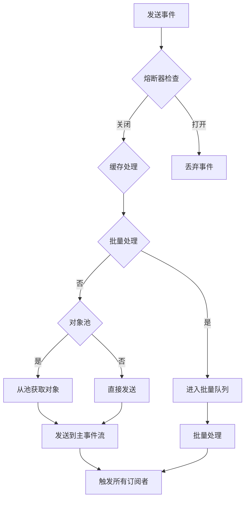

# EventBus

**生产级 Android 事件总线 · 基于 Kotlin Flow + Hilt**

## 📖 简介

**EventBus** 是一个基于 Kotlin Flow 和协程构建的**生产级事件总线**，专为 Android 应用设计。它结合了 Hilt 依赖注入，提供了类型安全、生命周期感知、高性能的事件通信解决方案。

```kotlin
```

### 定义事件

```kotlin
sealed class AppEvent {
    object UserLoginSuccess : AppEvent()
    data class UserLoginFailed(val error: String) : AppEvent()
}
```

### hilt依赖注入

#### 添加到di

```kotlin
@Module
@InstallIn(SingletonComponent::class)
object EventBusModule {

    @Provides
    @Singleton
    fun provideUltimateEventBus(): UltimateEventBus {
        return UltimateEventBus()
    }
}

```

#### 注入到使用的类中

```kotlin
    @Inject
lateinit var eventBus: UltimateEventBus
```
### koin依赖注入

#### 添加到di

```kotlin
val EventBusModule = module {
    single { UltimateEventBus() }
}

```

### 发送

```kotlin
    @Inject
lateinit var eventBus: UltimateEventBus

//基础发送
viewModelScope.launch {
    eventBus.ultimateSend(AppEvent.UserLoginSuccess)
}

// 非挂起版本（用于不能挂起的场景）
eventBus.tryUltimateSend(AppEvent.UserLoginSuccess)

//全部参数
eventBus.ultimateSend(
    event = AppEvent.DataUpdated(data),
    priority = Priority.HIGH,          // 优先级
    usePool = true,                    // 使用对象池
    cacheable = true,                  // 缓存事件
    batchable = true                   // 启用批量处理
)

//批量发送
viewModelScope.launch {
    val events = listOf(
        AppEvent.UserAction("action1"),
        AppEvent.UserAction("action2"),
        AppEvent.UserAction("action3")
    )
    events.forEach { event ->
        eventBus.ultimateSend(event, batchable = true)
    }
}
//使用扩展函数简化
viewModelScope.launch {
    eventBus.send(AppEvent.UserLoginSuccess, cacheable = true)
}

// 批量发送
viewModelScope.launch {
    eventBus.sendAll(
        listOf(
            AppEvent.AnalyticsEvent("page_view"),
            AppEvent.AnalyticsEvent("button_click")
        )
    )
}

// 发送并缓存事件
eventBus.ultimateSend(
    event = AppEvent.UserLoginSuccess,
    cacheable = true
)

// 获取缓存的事件
val cachedEvent = eventBus.getCachedEvent<AppEvent.UserLoginSuccess>()

// 清除所有缓存
eventBus.clearCache()

// 粘性订阅（自动接收缓存事件）
eventBus.subscribeSticky<AppEvent.UserLoginSuccess>(this) { event ->
    // 会立即收到缓存的登录成功事件
}
```

### 订阅事件

```kotlin
    // 在任意 CoroutineScope 中订阅
eventBus.subscribe<AppEvent.UserLoginSuccess>(
    scope = viewModelScope,
    priority = Priority.HIGH
) { event ->
    // 处理事件
    updateUI()
}

// 自动绑定 Activity/Fragment 生命周期
eventBus.subscribeWithLifecycle<AppEvent.ShowToast>(
    lifecycleOwner = this,
    state = Lifecycle.State.STARTED,  // 默认 STARTED
    priority = Priority.NORMAL
) { event ->
    Toast.makeText(this, event.message, Toast.LENGTH_SHORT).show()
}

// 粘性事件订阅 新订阅者会立即收到最后发送的事件
eventBus.subscribeSticky<AppEvent.UserLoginSuccess>(
    lifecycleOwner = this
) { event ->
    // 处理粘性事件
}

//批量事件订阅
eventBus.subscribeBatch(scope = viewModelScope) { events ->
    // 批量处理事件
    events.forEach { event ->
        when (event) {
            is AppEvent.AnalyticsEvent -> reportAnalytics(event)
            is AppEvent.UserAction -> handleUserAction(event)
        }
    }
}
// 使用 listen 扩展函数
eventBus.listen<AppEvent.ShowToast>(this) { event ->
    Toast.makeText(this, event.message, event.duration).show()
}
```

## 工作流程

